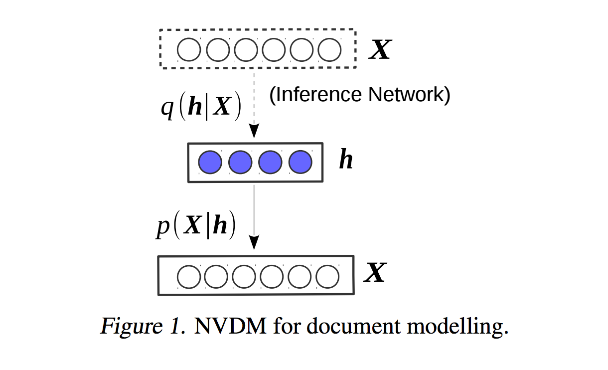

# Neural Variational Document Model
=================================
Tensorflow implementation of [Neural Variational Inference for Text Processing](http://arxiv.org/abs/1511.06038).

This implementation contains:

1. Neural Variational Document Model
    - Variational inference framework for generative model of text
    
    - Combines a stochastic document representation with a bag-of-words generative model

Prerequisites
-------------

- Python 2.7 or Python 3.3+
- [NLTK](http://www.nltk.org/)
- [TensorFlow](https://www.tensorflow.org/)

Usage
-----

To train a model with Ubuntu dataset:

    $ python train_tp.py --vocab_path data/vocab.en --data_path some_yaks.txt --model_dir models/ --vocab 75000

To test an existing model:

    $ python neural_conversation_model.py --train_dir ubuntu/ --en_vocab_size 60000 --size 512 --data_path ubuntu/train.tsv --dev_data ubuntu/valid.tsv  --vocab_path ubuntu/60k_vocan.en --attention --decode --beam_search --beam_size 25

## Contact
Parminder Bhatia, parminder.bhatia243@gmail.com
